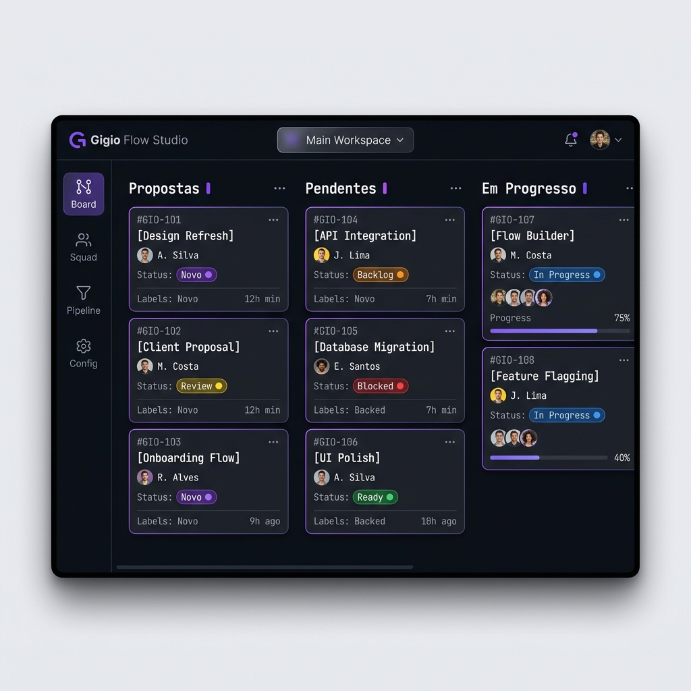
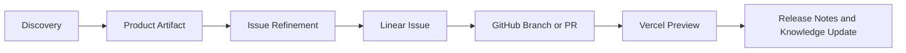

# Gigio Flow

**An open-source workspace protocol and local Studio for running Codex-powered AI squads across product discovery, technical planning, issue refinement, and delivery automation.**

   

Gigio Flow turns a Markdown workspace into a persistent operating system for AI-assisted product work. Instead of treating Codex or other coding agents as stateless chat sessions, it gives them durable project memory, squad roles, safety rules, product artifacts, and a delivery pipeline connected to Linear, GitHub, and Vercel.

> Status: early open-source launch preparation. The local Studio is functional, while the Linear, GitHub, and Vercel delivery bridge is being productized.



## Why Gigio Flow Exists

AI coding tools are powerful, but real software maintenance needs more than code generation. Maintainers need context, scope control, product reasoning, technical review, release discipline, and a clean handoff between humans and agents.

Gigio Flow is built around one idea:

**Codex should not work like a generic developer. It should operate inside a structured product squad.**

That squad can include:

- **CEO Agent** for strategic viability and product-market reasoning.
- **PM Agent** for PRDs, acceptance criteria, UX copy, and issue slicing.
- **CTO Agent** for architecture, API contracts, security, and technical risk.
- **Dev Agent** for scoped implementation.
- **QA Agent** for validation, accessibility, security, and release checks.
- **Process Analyst** for workflow improvement and bottleneck detection.

## What It Does

- Stores product and technical knowledge in portable Markdown files.
- Gives AI agents explicit squad roles, rules, templates, and rituals.
- Converts discovery into product artifacts, then into small implementation issues.
- Keeps a local workflow in `workflows/` while using Linear as the visual operational board.
- Prepares delivery handoff to GitHub pull requests and Vercel deployments.
- Preserves decisions, status, and project memory between AI sessions.

## Core Concept

Gigio Flow has two layers:

### 1. Workspace Protocol

The repository structure is the source of truth:

```text
.ai/          Agent squads, safety rules, skills, and templates
knowledge/   Product vision, architecture, roadmap, state, history
workflows/   Local Markdown cards for proposals, pending work, and active work
boards/      Optional Obsidian boards
dashboard/   Local Studio frontend and backend
```

### 2. Local Studio

The Studio is a local web app that helps humans and agents operate the workspace:

- project setup wizard
- squad configuration
- CEO/PM discovery flow
- Kanban view backed by Markdown files
- LLM refinement pipeline
- Linear integration settings
- health checks for the workspace

The Studio is intentionally local-first. The Markdown files remain readable by humans, Git, Codex, Cursor, Claude Code, and other agentic tools.

## Delivery Model

Gigio Flow does not try to replace Linear, GitHub, or Vercel. It controls the product and agent context around them.



- **Linear** is the visual operational board.
- **GitHub** is the code and pull request layer.
- **Vercel** is the deployment and preview layer.
- **Gigio Flow** is the product memory, agent protocol, and delivery orchestration layer.

## Quickstart

### Requirements

- Node.js 20+
- npm
- A local clone of this repository

### Run the Studio

**Option A — from the repository root:**

```bash
npm run install:all
npm run studio
```

**Option B — from the dashboard directory:**

```bash
cd dashboard
npm install
npm run dev
```

Open:

- Studio frontend: `http://localhost:5173`
- Local API: `http://localhost:3001`

### Configure Environment

Copy the example file:

```bash
cp dashboard/.env.example dashboard/.env
```

API keys are optional for local exploration. LLM keys should stay local and must not be committed.

## Codex-First Workflow

A typical Gigio Flow session with Codex:

1. Read `AGENTS.md`, `knowledge/ESTADO_ATUAL.md`, and active workflow cards.
2. Select the right squad role for the task.
3. Convert a raw idea into a product artifact.
4. Refine the artifact into a small, testable issue.
5. Estimate complexity and identify technical risk.
6. Create or update a Linear issue.
7. Implement through GitHub.
8. Verify the Vercel preview.
9. Update `knowledge/ESTADO_ATUAL.md` and `knowledge/HISTORICO.md`.

More detail: [Codex Workflows](docs/CODEX_WORKFLOWS.md).

## Demo Script

Use the public demo script to show the project in a few minutes:

1. create a raw product idea
2. turn it into a PRD
3. refine it into a small issue
4. send it to Linear
5. connect implementation to GitHub
6. validate the Vercel preview
7. update project memory

See [Demo Script](docs/DEMO_SCRIPT.md).

## Open Source Roadmap

The public roadmap is focused on making Gigio Flow useful for real maintainers:

- Codex-first documentation and examples
- Linear issue creation and webhook sync
- GitHub branch, PR, and changelog handoff
- Vercel preview/deployment status sync
- stricter security checks for local file operations
- reusable templates for product and technical artifacts

See [Roadmap](ROADMAP.md).

## Repository Health & Testing

The repository has a comprehensive suite of 25 automated unit and integration tests covering physical file security (Path Traversal protection), local Kanban workflows, LLM pipeline mock simulations, and Linear GraphQL integrations.

Before opening a pull request:

```bash
cd dashboard
npm install
npm run test
npm run lint
npm run build
```

## Security

Gigio Flow is local-first, but it can handle API tokens for LLMs, Linear, GitHub, and Vercel. Never commit `.env`, local config files, or private keys.

See [Security Policy](SECURITY.md).

## Contributing

Contributions are welcome. The best first contributions are:

- documentation improvements
- Codex workflow examples
- Linear/GitHub/Vercel integration hardening
- security review
- issue templates and product artifact templates

See [Contributing Guide](CONTRIBUTING.md).

## Changelog

See [CHANGELOG.md](CHANGELOG.md) for a full history of releases.

## License

MIT. See [LICENSE](LICENSE).
