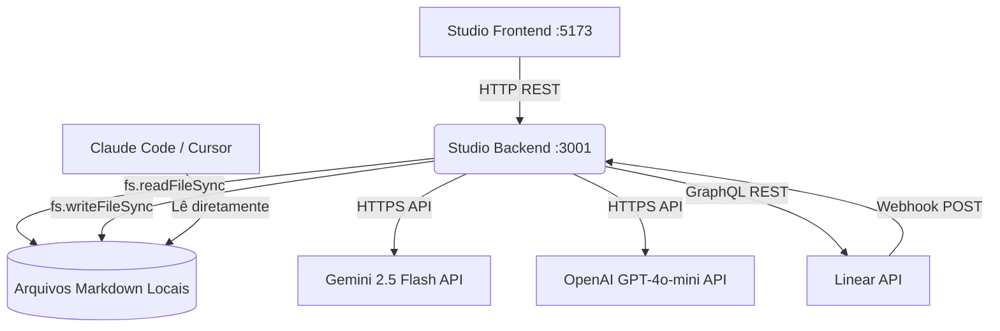

# Arquitetura Técnica do Sistema — Gigio Flow

> Este arquivo é o manual técnico oficial da infraestrutura. O CTO Agent e o Dev Agent o consultam e o mantêm atualizado a cada evolução na stack.

---

## 🛠️ 1. Visão Geral da Stack Tecnológica

| Camada | Tecnologia Selecionada | Papel no Sistema |
| :--- | :--- | :--- |
| **Frontend / Cliente** | React 19 + Vite 8 + Lucide Icons | Interface visual do Studio (dashboard) |
| **Backend / API** | Node.js + Express 5 (ESM) | API REST local que lê/escreve os arquivos Markdown |
| **Banco de Dados** | Sistema de Arquivos (Markdown) | Toda persistência é feita em arquivos .md locais |
| **LLM Integration** | Google Gemini 2.5 Flash + OpenAI GPT-4o-mini | Análise estratégica (CEO), refinamento de PRD, estimativa, QA técnico |
| **Gestão Operacional** | Linear App (via API REST) | Tickets, sprints, kanban operacional pós-aprovação |
| **Estilo CSS** | CSS Variables (vanilla) | Tokens de design no index.css, sem framework CSS |

---

## 🌐 2. Fluxo e Integração de Dados



---

## 🔒 3. Políticas de Segurança e Controle de Acesso

-   **Autenticação:** O Studio é uma ferramenta local. O servidor Express roda apenas no localhost. CORS restrito às origens `:5173` e `:3000`.
-   **API Keys LLM:** Passadas pelo frontend para o backend apenas durante chamadas on-demand. O backend NUNCA as persiste — ficam no `localStorage` do navegador.
-   **Chaves Linear:** Configuradas via painel de Integrações e salvas em `dashboard/linear-config.json` (local, fora do workspace de projetos).
-   **Segurança de Arquivos:** Todas as operações de I/O validam o path com `validatePath(baseDir, targetPath)` para prevenir Path Traversal attacks. O path resolvido deve sempre estar dentro do `activeWorkspaceDir`.
-   **Rate Limiting:** Rotas que chamam LLMs externas têm limite de 10 requisições/minuto via `express-rate-limit`.

---

## 🗂️ 4. Estrutura de Módulos do Backend

```
dashboard/
├── server.js              ← Orquestrador: dotenv, CORS, rate limit, routers
├── .env                   ← Variáveis de ambiente (PORT, LINEAR_*)
├── linear-config.json     ← Config da integração Linear (auto-gerado)
├── projects.json          ← Lista de workspaces registrados
├── services/
│   ├── files.js           ← I/O seguro de arquivos (validatePath, read, write)
│   └── llm.js             ← Connector LLM (callLLM, buildSystemContext)
└── routes/
    ├── projects.js        ← CRUD de workspaces
    ├── workflow.js        ← Kanban, pipeline LLM, movimentação de cards
    ├── system.js          ← Status, diagnóstico, initialize, apply-template
    └── linear.js          ← Integração Linear (settings, create-issue, webhook)
```

---

## 🗂️ 5. Estrutura de Módulos do Frontend

```
dashboard/src/
├── App.jsx                     ← Estado global + roteamento de tabs
├── main.jsx                    ← Entry point React
├── index.css                   ← Design tokens (CSS variables)
├── hooks/
│   └── useApi.js               ← Abstrações de fetch
└── components/
    ├── Sidebar.jsx              ← Navegação lateral
    ├── TopBar.jsx               ← Barra de título + search
    ├── KanbanBoard.jsx          ← Kanban com drag-and-drop HTML5
    ├── CreateCardModal.jsx      ← Modal de criação de novo card
    ├── PipelineView.jsx         ← Visualização step-by-step do pipeline
    ├── OnboardingWizard.jsx     ← Wizard de configuração inicial
    ├── SquadOrganogram.jsx      ← Organograma de squads
    ├── CeoChat.jsx              ← Chat de ideação com CEO Agent
    ├── RitualsGates.jsx         ← Gates de aprovação e rituais
    ├── GuideView.jsx            ← Diagnóstico + arquitetura
    └── LinearSettings.jsx       ← Configuração da integração Linear
```

---

## 🚀 6. Ambientes e Pipelines de Deploy

-   **Desenvolvimento:** `npm run dev` no diretório `dashboard/` inicia backend (:3001) e frontend (:5173) simultaneamente via `start-studio.js`.
-   **Staging:** N/A — ferramenta local por design.
-   **Produção:** N/A — ferramenta local por design (Fase 3 introduzirá versão cloud).

---

## 📡 7. Contrato de APIs — Endpoints do Studio

### Projects
| Método | Rota | Descrição |
| :--- | :--- | :--- |
| GET | `/api/projects` | Lista workspaces |
| POST | `/api/projects/add` | Adiciona workspace |
| POST | `/api/projects/select` | Ativa workspace |
| DELETE | `/api/projects` | Remove workspace |

### Project Config
| Método | Rota | Descrição |
| :--- | :--- | :--- |
| GET | `/api/project/status` | Status + squads + approvals |
| POST | `/api/project/initialize` | Grava configuração nos MDs |
| POST | `/api/project/apply-template` | Aplica preset Lean/Enterprise/Tech |
| POST | `/api/project/apply-example` | Aplica exemplo pré-configurado |

### Workflow Pipeline
| Método | Rota | Descrição |
| :--- | :--- | :--- |
| GET | `/api/workflow/board` | Lê cards de todas as fases |
| POST | `/api/workflow/move` | Move card entre fases |
| POST | `/api/workflow/create-card` | Cria novo card via UI |
| POST | `/api/workflow/refine` | Refina PRD com contexto LLM |
| POST | `/api/workflow/estimate` | Estima complexidade com LLM |
| POST | `/api/workflow/qa-review` | QA técnico com LLM |
| POST | `/api/workflow/human-approve` | Gate de aprovação humana |
| POST | `/api/workflow/approve-ceo` | Análise CEO (simulação) |
| POST | `/api/workflow/approve-ceo-real` | Análise CEO (LLM real) |

### System
| Método | Rota | Descrição |
| :--- | :--- | :--- |
| GET | `/api/system/check` | Diagnóstico de saúde |
| POST | `/api/system/fix-placeholder` | Corrige placeholder inline |

### Linear
| Método | Rota | Descrição |
| :--- | :--- | :--- |
| GET | `/api/linear/settings` | Retorna status da conexão |
| POST | `/api/linear/settings` | Salva API key + team ID |
| POST | `/api/linear/create-issue` | Cria issue a partir do card |
| POST | `/api/linear/webhook` | Recebe updates do Linear |
