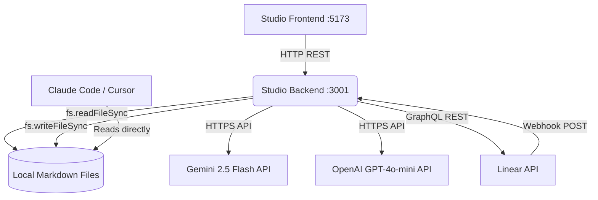

# System Technical Architecture — Gigio Flow

> This file is the official technical manual of the infrastructure. The CTO Agent and Dev Agent consult it and keep it updated with every evolution in the stack.

---

## 🛠️ 1. Technology Stack Overview

| Layer | Selected Technology | Role in the System |
| :--- | :--- | :--- |
| **Frontend / Client** | React 19 + Vite 8 + Lucide Icons | Visual interface of the Studio (dashboard) |
| **Backend / API** | Node.js + Express 5 (ESM) | Local REST API that reads/writes Markdown files |
| **Database** | File System (Markdown) | All persistence is done in local .md files |
| **LLM Integration** | Google Gemini 2.5 Flash + OpenAI GPT-4o-mini | Strategic analysis (CEO), PRD refinement, estimation, technical QA |
| **Operational Management** | Linear App (via REST API) | Tickets, sprints, operational kanban post-approval |
| **CSS Styling** | CSS Variables (vanilla) | Design tokens in index.css, no CSS framework |

---

## 🌐 2. Data Flow and Integration



---

## 🔒 3. Security Policies and Access Control

-   **Authentication:** The Studio is a local tool. The Express server runs only on localhost. CORS restricted to origins `:5173` and `:3000`.
-   **LLM API Keys:** Passed from frontend to backend only during on-demand calls. The backend NEVER persists them — they are stored in the browser's `localStorage`.
-   **Linear Keys:** Configured via the Integrations panel and saved in `dashboard/linear-config.json` (local, outside the project workspace).
-   **File Security:** All I/O operations validate the path with `validatePath(baseDir, targetPath)` to prevent Path Traversal attacks. The resolved path must always be within the `activeWorkspaceDir`.
-   **Rate Limiting:** Routes that call external LLMs have a limit of 10 requests/minute via `express-rate-limit`.

---

## 🗂️ 4. Backend Module Structure

```
dashboard/
├── server.js              ← Orchestrator: dotenv, CORS, rate limit, routers
├── .env                   ← Environment variables (PORT, LINEAR_*)
├── linear-config.json     ← Linear integration config (auto-generated)
├── projects.json          ← List of registered workspaces
├── services/
│   ├── files.js           ← Secure file I/O (validatePath, read, write)
│   └── llm.js             ← LLM connector (callLLM, buildSystemContext)
└── routes/
    ├── projects.js        ← Workspace CRUD
    ├── workflow.js        ← Kanban, LLM pipeline, card movement
    ├── system.js          ← Status, diagnostics, initialize, apply-template
    └── linear.js          ← Linear integration (settings, create-issue, webhook)
```

---

## 🗂️ 5. Frontend Module Structure

```
dashboard/src/
├── App.jsx                     ← Global state + tab routing
├── main.jsx                    ← React entry point
├── index.css                   ← Design tokens (CSS variables)
├── hooks/
│   └── useApi.js               ← Fetch abstractions
└── components/
    ├── Sidebar.jsx              ← Side navigation
    ├── TopBar.jsx               ← Title bar + search
    ├── KanbanBoard.jsx          ← Kanban with HTML5 drag-and-drop
    ├── CreateCardModal.jsx      ← New card creation modal
    ├── PipelineView.jsx         ← Step-by-step pipeline visualization
    ├── OnboardingWizard.jsx     ← Initial configuration wizard
    ├── SquadOrganogram.jsx      ← Squad organizational chart
    ├── CeoChat.jsx              ← Ideation chat with CEO Agent
    ├── RitualsGates.jsx         ← Approval gates and rituals
    ├── GuideView.jsx            ← Diagnostics + architecture
    └── LinearSettings.jsx       ← Linear integration configuration
```

---

## 🚀 6. Environments and Deploy Pipelines

-   **Development:** `npm run dev` in the `dashboard/` directory starts the backend (:3001) and frontend (:5173) simultaneously via `start-studio.js`.
-   **Staging:** N/A — local tool by design.
-   **Production:** N/A — local tool by design (Phase 3 will introduce a cloud version).

---

## 📡 7. API Contract — Studio Endpoints

### Projects
| Method | Route | Description |
| :--- | :--- | :--- |
| GET | `/api/projects` | List workspaces |
| POST | `/api/projects/add` | Add workspace |
| POST | `/api/projects/select` | Activate workspace |
| DELETE | `/api/projects` | Remove workspace |

### Project Config
| Method | Route | Description |
| :--- | :--- | :--- |
| GET | `/api/project/status` | Status + squads + approvals |
| POST | `/api/project/initialize` | Write configuration to MDs |
| POST | `/api/project/apply-template` | Apply Lean/Enterprise/Tech preset |
| POST | `/api/project/apply-example` | Apply pre-configured example |

### Workflow Pipeline
| Method | Route | Description |
| :--- | :--- | :--- |
| GET | `/api/workflow/board` | Read cards from all phases |
| POST | `/api/workflow/move` | Move card between phases |
| POST | `/api/workflow/create-card` | Create new card via UI |
| POST | `/api/workflow/refine` | Refine PRD with LLM context |
| POST | `/api/workflow/estimate` | Estimate complexity with LLM |
| POST | `/api/workflow/qa-review` | Technical QA with LLM |
| POST | `/api/workflow/human-approve` | Human approval gate |
| POST | `/api/workflow/approve-ceo` | CEO analysis (simulation) |
| POST | `/api/workflow/approve-ceo-real` | CEO analysis (real LLM) |

### System
| Method | Route | Description |
| :--- | :--- | :--- |
| GET | `/api/system/check` | Health diagnostics |
| POST | `/api/system/fix-placeholder` | Fix inline placeholder |

### Linear
| Method | Route | Description |
| :--- | :--- | :--- |
| GET | `/api/linear/settings` | Returns connection status |
| POST | `/api/linear/settings` | Save API key + team ID |
| POST | `/api/linear/create-issue` | Create issue from card |
| POST | `/api/linear/webhook` | Receive updates from Linear |
